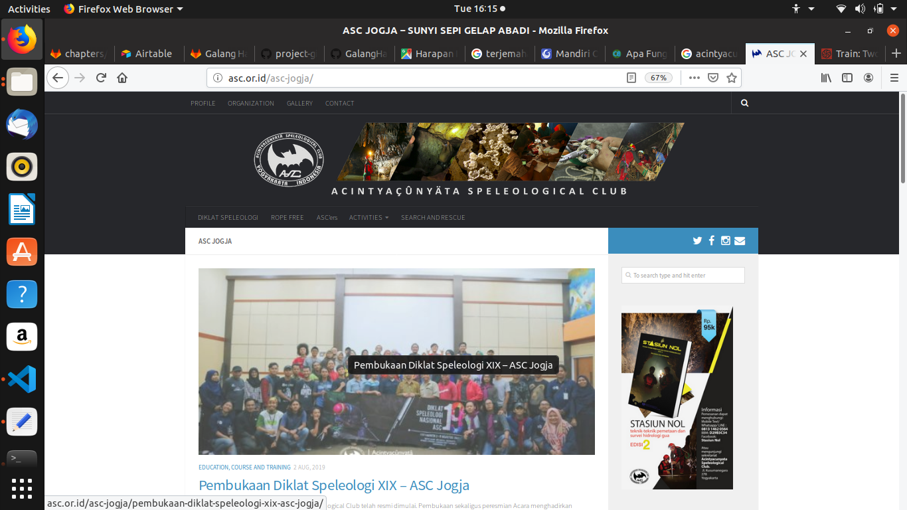
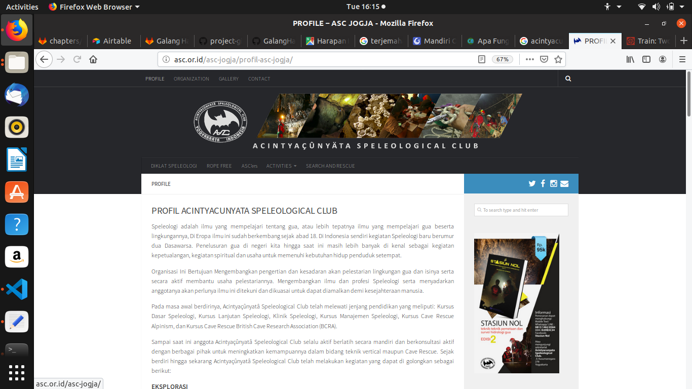
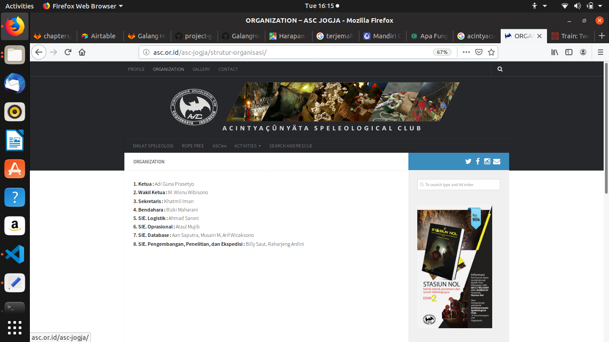
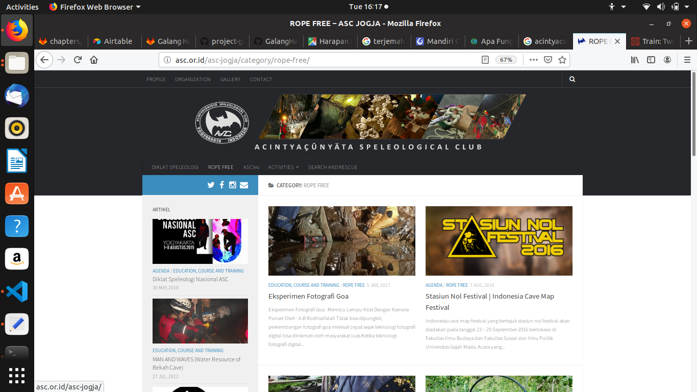
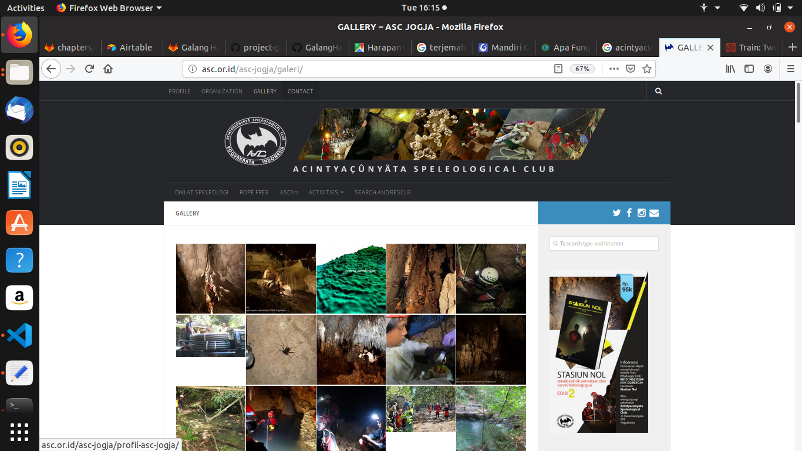
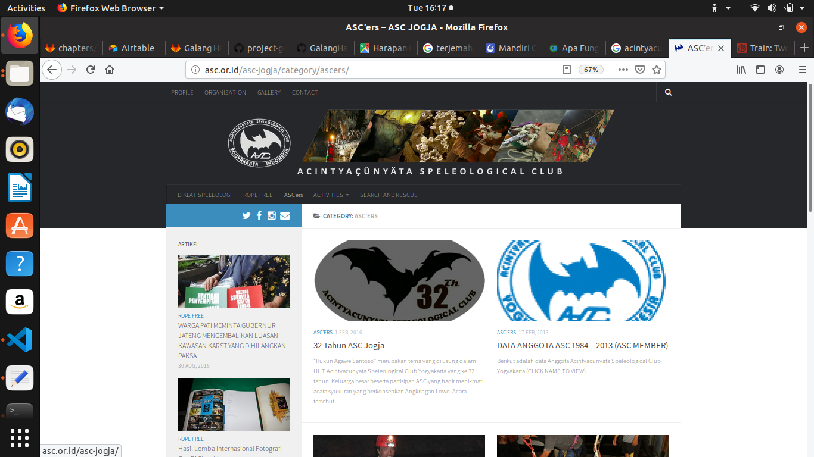
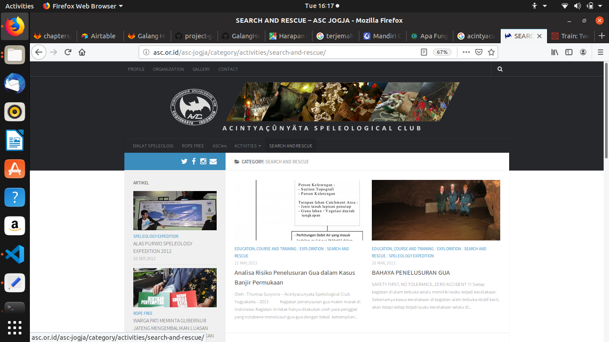
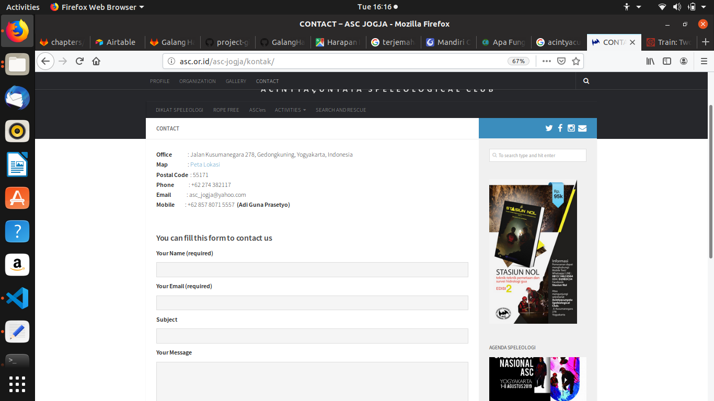

# asc.or.id

[**asc.or.id**](https://asc.org) is the website of Acintyacunyata Speleological Club, based on Kusumanegara Yogyakarta. ASC is a speleological club which the activity is all about research on karst environment. Once in every year we always make a speleological expedition to collect data from area that we choose all around Indonesia.

## FEATURES

- **HOME**
  - Update all news about ASC activity. From expedition, recruitment to weekly activity from member.

- **PROFILE**
  - History of the organization.

- **ORGANIZATION**
  - Organizational structure.

- **ROPE FREE**
  - Activity news, not only about caving and research but also recruitment, environment issue and speleological activity around the world.

- **GALLERY**
  - Photo gallery from member activity. Not only exploration activity but also social and course activity.

- **ASC'ers**
  - Information about member and organization anniversary.

- **SEARCH AND RESCUE**
  - search and rescue activity news.

- **CONTACT**
  - Office
  - Map
  - Phone
  - Mobile phone
  - Email

 ## SCREENSHOT
 
 
   
 
 
 
 
 

